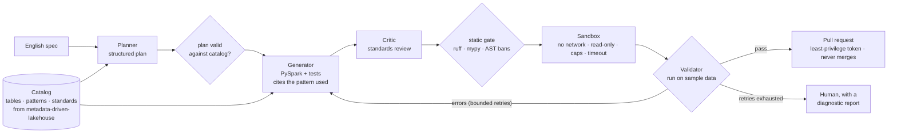
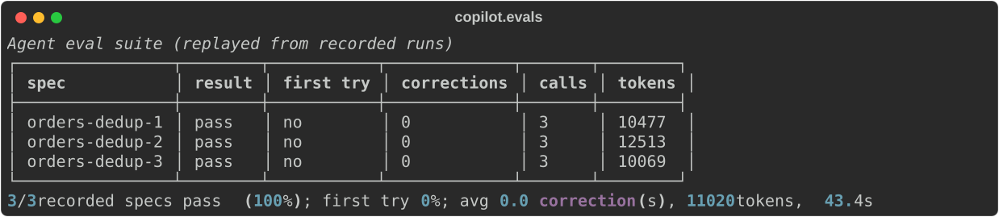

# agentic-pipeline-copilot

> An English spec in; a PySpark notebook out that has been checked against
> the lakehouse's standards, executed in a sandbox, tested, and opened as a
> pull request - never merged by the agent.

[](https://github.com/Pranay777777/agentic-pipeline-copilot/actions/workflows/ci.yml)


[](LICENSE)

**[Build log: running code an LLM wrote, safely](docs/build-log.md)** - a sandbox
first, then self-correction (5-minute read).

> **Status:** feature-complete: catalog, agents, sandboxed execution with
> self-correction, static gate, generated tests, pull requests, MCP tools,
> replay and the cost governor all work and are tested. The 50-spec eval suite
> is being recorded in daily batches on a free model tier (4/50 so far);
> v1.0.0 is tagged when it is complete. Every number links to the run that produced it.

## The problem

Writing a new pipeline notebook for a metadata-driven lakehouse means
knowing its tables, its patterns (deduplicate in Silver, SCD2 via MERGE,
surrogate keys and unknown members in Gold) and its standards (no hardcoded
paths, no unbounded `collect()`, idempotent writes). A general-purpose model
knows PySpark, not *this* lakehouse - so it writes plausible code that uses
the wrong columns and breaks the conventions, and nothing runs it before a
human has to.

## The approach



Why agents rather than one prompt - and what that costs in latency and
tokens - is argued in [ADR-002](docs/adr/0002-multi-agent-vs-single-prompt.md).
The short version: agents only where a deterministic check sits between
them, everything bounded, and a single-prompt baseline measured alongside.

## Results

| Metric | Value | How measured |
|---|---|---|
| Catalog retrieval (BM25) | **Recall@5 0.94 · MRR 0.84** (Recall@1 0.60, Recall@3 0.85) | [24 labelled questions](docs/results/catalog-retrieval.md) over 49 documents from metadata-driven-lakehouse v1.0.0 |
| Eval suite (recorded specs) | **3/3 pass · first try 0%** · avg 0.0 correction(s), 11020 tokens | [replayed in CI](docs/adr/0008-eval-suite-replayed-gate.md); 3 of 50 specs recorded so far |
| Sandbox isolation | network, DNS, job and root writes blocked; non-root; no secrets | `python -m copilot.sandbox check`, run in CI on every push |

## Try the catalog

```bash
pip install -e ".[dev]"
python -m copilot.catalog search "how do we keep history when a customer's city changes?"
python -m copilot.catalog search "can a notebook call collect?" --kind standard
python -m copilot.catalog bench
# refresh from a lakehouse checkout:
python -m copilot.catalog snapshot --lakehouse ../metadata-driven-lakehouse
```

## Try the agents

```bash
# OPENROUTER_API_KEY in .env (a free key from openrouter.ai/keys); Docker running
python -m copilot.sandbox build     # the pinned sandbox image (once)
python -m copilot.sandbox check     # proves: no network, read-only, non-root, no secrets
python -m copilot.agents run "Load orders incrementally into Silver, one row per order_id, newest wins" \
    --trace runs/orders.json
python -m copilot.agents review notebooks/orders_silver.py   # the Critic's rules; no key needed

# pull requests: PR_REPO and COPILOT_GITHUB_TOKEN in .env (fine-grained, that repo only)
python -m copilot.pr check
python -m copilot.agents run "..." --open-pr

# record a run's model calls; replay them later with no model, key or network
python -m copilot.agents run "..." --record runs/orders.cassette.jsonl
python -m copilot.agents run "..." --replay runs/orders.cassette.jsonl
```

Every run has a budget - 8 model calls and 60 000 tokens by default
(`RUN_MAX_CALLS`, `RUN_MAX_TOKENS`) - and stops hard when it is spent.

## Demo

A recorded live run, replayed (no model, no network) and executed for real in the
sandbox: spec → plan → notebook → review → sandbox → generated tests → ready.


The model calls come from [`tests/cassettes/orders_silver.jsonl`](tests/cassettes/orders_silver.jsonl),
a real Gemini run; CI replays it on every push. A live run opened
[copilot-playground#1](https://github.com/Pranay777777/copilot-playground/pull/1) - the agent never merges.



Failures are part of the record: a stage sent back, then recovered within the
two-round correction budget ([ADR-005](docs/adr/0005-sandbox-validator-correction.md)).


## How good is it? The eval suite

`evals/specs.json` holds 50 plain-English specs with the plan each should
produce. Each is recorded once against a real model and then replayed - no
model, no key, no network - so CI gates every push on them: a spec that used
to pass and now fails, or a pass rate under 80%, fails the build
([ADR-008](docs/adr/0008-eval-suite-replayed-gate.md)).

```bash
python -m copilot.evals record --limit 6   # live, in batches (free tiers allow ~20 requests/day)
python -m copilot.evals gate               # replay all recorded specs; fail on regressions
python -m copilot.evals render             # docs/images/eval-report.svg, recovery.svg
```

## Use it from an MCP client

`python -m copilot.mcp_server` serves the catalog and the notebook gates over
stdio: `search_catalog`, `get_catalog_doc`, `review_notebook`,
`generate_notebook_tests` and `validate_notebook` (sandboxed). No tool calls a
model, writes a file or opens a pull request
([ADR-007](docs/adr/0007-mcp-tools-replay-cost-governor.md)). For example, in
an MCP client's server configuration:

```json
{
  "mcpServers": {
    "pipeline-copilot": {
      "command": "/path/to/agentic-pipeline-copilot/.venv/bin/python",
      "args": ["-m", "copilot.mcp_server"]
    }
  }
}
```

Every notebook passes a static gate (ruff, mypy) and runs on sample data in the
sandbox, with pytest tests derived from the plan and the catalog's data
contracts, before it is called ready. `--open-pr` then opens a pull request
with the notebook and its tests on one playground repository, through a
fine-grained token - it never merges
([ADR-006](docs/adr/0006-static-gate-generated-tests-pull-requests.md)).
Failures at any gate go back to the Generator for at most two correction
rounds, then the run escalates with a diagnostic report
([ADR-005](docs/adr/0005-sandbox-validator-correction.md)).

The Planner's plan is checked against the catalog, the Generator's cells
must cite the catalog patterns they follow, and the Critic's rules enforce
the standards line by line - everything bounded, and a rejected run says
which stage failed and why ([ADR-004](docs/adr/0004-planner-generator-critic.md)).
Notebooks are Databricks source files (`.py`).

## Roadmap

- [x] Repository, CI gates and the multi-agent decision ([ADR-002](docs/adr/0002-multi-agent-vs-single-prompt.md))
- [x] Catalog index over the lakehouse's metadata ([ADR-003](docs/adr/0003-catalog-index.md))
- [x] Planner, Generator and Critic agents ([ADR-004](docs/adr/0004-planner-generator-critic.md))
- [x] Sandboxed executor and Validator with a bounded self-correction loop ([ADR-005](docs/adr/0005-sandbox-validator-correction.md))
- [x] Static-analysis gate and generated tests ([ADR-006](docs/adr/0006-static-gate-generated-tests-pull-requests.md))
- [x] Pull-request tool (least privilege, never merges)
- [x] MCP tool layer, deterministic replay and a per-run cost governor ([ADR-007](docs/adr/0007-mcp-tools-replay-cost-governor.md))
- [x] Agent eval suite (50 specs, recorded once, replayed in CI) and its regression gate ([ADR-008](docs/adr/0008-eval-suite-replayed-gate.md))
- [x] [Threat model](docs/threat-model.md) mapped to the OWASP Agentic Top 10 and MCP Top 10
- [x] Demo GIF and published eval table
- [ ] All 50 eval specs recorded, then the v1.0.0 release

## Development

```bash
pip install -e ".[dev]"
ruff check . && ruff format --check . && mypy && pytest
```

Decisions are recorded in [docs/adr](docs/adr). CI runs lint, strict mypy,
tests on Python 3.11 and 3.12 (Ubuntu) and 3.12 (Windows), gitleaks over
every ref, pip-audit and a Docker build.

## Related

- [metadata-driven-lakehouse](https://github.com/Pranay777777/metadata-driven-lakehouse) - the platform whose notebooks this generates (Flagship 1)
- [evidence-grounded-resume-engine](https://github.com/Pranay777777/evidence-grounded-resume-engine) - grounded generation with a measured fabrication rate (Flagship 2)

## License

MIT - see [LICENSE](LICENSE).
