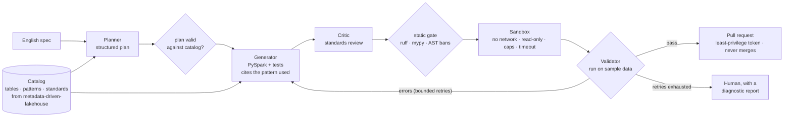

# agentic-pipeline-copilot

> An English spec in; a PySpark notebook out that has been checked against
> the lakehouse's standards, executed in a sandbox, tested, and opened as a
> pull request - never merged by the agent.

[](https://github.com/Pranay777777/agentic-pipeline-copilot/actions/workflows/ci.yml)


[](LICENSE)

> **Status:** early. The catalog ships first; the agents follow one at a
> time. Nothing is listed as working until it is tested, and every number
> links to the run that produced it.

## The problem

Writing a new pipeline notebook for a metadata-driven lakehouse means
knowing its tables, its patterns (deduplicate in Silver, SCD2 via MERGE,
surrogate keys and unknown members in Gold) and its standards (no hardcoded
paths, no unbounded `collect()`, idempotent writes). A general-purpose model
knows PySpark, not *this* lakehouse - so it writes plausible code that uses
the wrong columns and breaks the conventions, and nothing runs it before a
human has to.

## The approach



Why agents rather than one prompt - and what that costs in latency and
tokens - is argued in [ADR-002](docs/adr/0002-multi-agent-vs-single-prompt.md).
The short version: agents only where a deterministic check sits between
them, everything bounded, and a single-prompt baseline measured alongside.

## Results

| Metric | Value | How measured |
|---|---|---|
| Catalog retrieval (BM25) | **Recall@5 0.94 · MRR 0.84** (Recall@1 0.60, Recall@3 0.85) | [24 labelled questions](docs/results/catalog-retrieval.md) over 49 documents from metadata-driven-lakehouse v1.0.0 |
| First-try notebook success | - | agent eval suite (step 78) |
| Sandbox isolation | - | step 69 |

## Try the catalog

```bash
pip install -e ".[dev]"
python -m copilot.catalog search "how do we keep history when a customer's city changes?"
python -m copilot.catalog search "can a notebook call collect?" --kind standard
python -m copilot.catalog bench
# refresh from a lakehouse checkout:
python -m copilot.catalog snapshot --lakehouse ../metadata-driven-lakehouse
```

## Roadmap

- [x] Repository, CI gates and the multi-agent decision ([ADR-002](docs/adr/0002-multi-agent-vs-single-prompt.md))
- [x] Catalog index over the lakehouse's metadata ([ADR-003](docs/adr/0003-catalog-index.md))
- [ ] Planner, Generator and Critic agents
- [ ] Sandboxed executor and Validator with a bounded self-correction loop
- [ ] Static-analysis gate and generated tests
- [ ] Pull-request tool (least privilege, never merges) and an MCP tool layer
- [ ] Deterministic replay, cost governor, agent eval suite and CI gate
- [ ] Threat model (OWASP Agentic and MCP Top 10), tracing, release

## Development

```bash
pip install -e ".[dev]"
ruff check . && ruff format --check . && mypy && pytest
```

Decisions are recorded in [docs/adr](docs/adr). CI runs lint, strict mypy,
tests on Python 3.11 and 3.12 (Ubuntu) and 3.12 (Windows), gitleaks over
every ref, pip-audit and a Docker build.

## Related

- [metadata-driven-lakehouse](https://github.com/Pranay777777/metadata-driven-lakehouse) - the platform whose notebooks this generates (Flagship 1)
- [evidence-grounded-resume-engine](https://github.com/Pranay777777/evidence-grounded-resume-engine) - grounded generation with a measured fabrication rate (Flagship 2)

## License

MIT - see [LICENSE](LICENSE).
