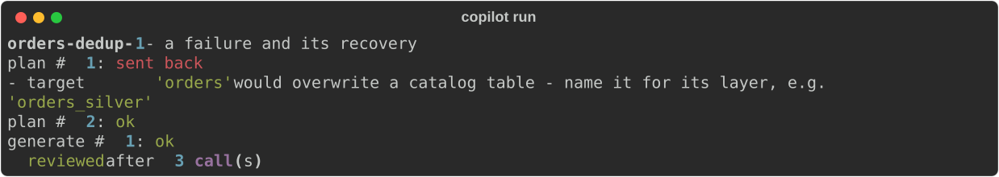

# Running code an LLM wrote, safely: a sandbox first, then self-correction

## The problem

The copilot turns an English spec into a PySpark notebook for a metadata-driven
lakehouse. A model knows PySpark. It does not know this lakehouse's tables,
patterns or standards, so it writes plausible code with the wrong columns. The
only way to find out is to run that code. But running code a model wrote is the
riskiest thing the copilot does. So I built the safety first and the
self-correction second.

## Sandbox first

Rule one: never `exec()` model code in the copilot's own process. Every notebook
runs in a pinned Docker container with no network, a read-only root filesystem,
no capabilities, `no-new-privileges` and a non-root user. It is capped at 2 CPUs, 2 GB of memory with no extra swap and 512
processes. After 240 seconds it is killed with `docker kill`, not asked to stop.
No host environment variable goes in, so no key can leak.

I don't trust the flags just because I wrote them. `python -m copilot.sandbox
check` runs a probe inside the real container. It tries the network, DNS,
writing to the job and the root filesystem, and reading secrets. It fails unless
each one is blocked, and CI runs it on every push. The decision is in
[ADR-005](adr/0005-sandbox-validator-correction.md); the threats it answers are
in the [threat model](threat-model.md).

## Catch problems before running

Spark takes tens of seconds to start, and many mistakes are visible without it.
The Critic is code, not a model: AST rules, each tied to a catalog standard. It
flags unbounded `collect()`, `SELECT *`, blind appends, and storage paths or
credentials written as literals, each at its notebook line
([ADR-004](adr/0004-planner-generator-critic.md)). Then a static gate runs inside
the sandbox: ruff, and mypy with PySpark's types, so a typo like `df.colect()`
fails in seconds. A tool that cannot run counts as a finding. The gate fails
closed ([ADR-006](adr/0006-static-gate-generated-tests-pull-requests.md)).

## Self-correction, with a limit

Review findings and execution errors go back to the Generator as structured
errors: stage, cell, notebook line, exception. Both share one budget of two
correction rounds. If problems remain, the run is escalated, not retried
forever. The copilot writes a report with every model answer, review and
execution, so a person can see what went wrong. A per-run governor also stops
hard at 8 calls or 60,000 tokens
([ADR-007](adr/0007-mcp-tools-replay-cost-governor.md)).

Here is a real failure from the eval suite. The first plan targeted `orders`,
which would overwrite a catalog table. The plan check sent it back with the
reason. The second plan passed, and the run was reviewed after 3 calls.
Strictly, this was the planner's own retry, not one of the two correction rounds.
I don't yet have a recorded run where an execution error was fixed by a
correction round; the eval batches should produce one.

Not every run recovers. One recorded run
[made the same planning mistake twice](examples/orders_silver.rejected.trace.json)
and was rejected, with its reasons kept.

## Free-tier reality

Everything runs on free model tiers, which allow about 20 requests a day. So CI
never calls a model. Real runs are recorded as cassettes and replayed with no
key and no network ([ADR-008](adr/0008-eval-suite-replayed-gate.md)). The eval
suite has 50 specs; 3 are recorded so far, and all 3 pass.

One lesson came from the quota. My retry code treated every 429 as temporary.
A daily-quota 429 is not: waiting a minute does not bring the quota back. The
batch kept retrying and spending requests for nothing.
[The fix](https://github.com/Pranay777777/agentic-pipeline-copilot/commit/92ea5e5)
stops the batch at once when the daily quota is used up. v1.0.0 waits until all
50 specs are recorded.

## What I'd do differently

I would record and replay from the first live run, not add it later. I would
sort provider errors into temporary, quota and fatal from day one. And I would
plan the eval suite around the quota: a run takes two to four calls, so 50
specs need about 5–10 days of free requests.
